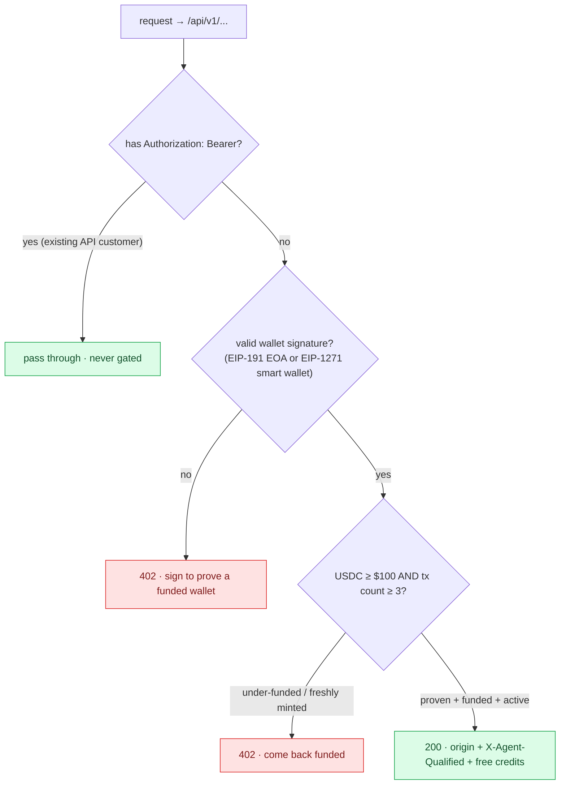
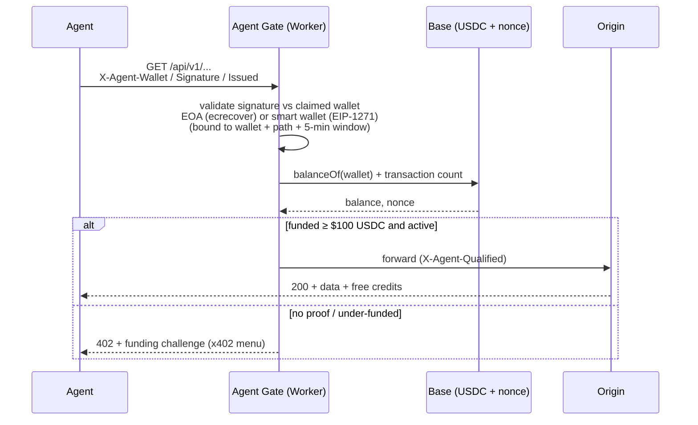
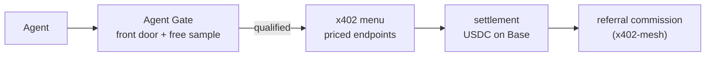

# Agent Gate

[](https://deploy.workers.cloudflare.com/?url=https://github.com/StartupHub-AI/agent-gate)

A Cloudflare Worker that gates your data/API surface on **economics, not identity**.
Before the origin is touched it proves the caller controls a funded wallet, reads its
on-chain USDC balance + activity on Base, and either welcomes a qualified agent buyer
(serve + free credits, pay-per-call via [x402](https://github.com/StartupHub-AI/x402-mesh))
or returns a `402` funding challenge. Existing API-key customers and public pages pass
straight through, so nothing you already serve breaks.

> **Live demo:** it's running in front of a real API right now. Try it:
> ```bash
> curl https://www.startuphub.ai/api/v1/startups
> ```
> You get the `402` agent challenge. Send a valid `Authorization: Bearer <key>` and you
> pass straight through to normal auth.

## Where this fits (Cloudflare Monetization Gateway / x402)

Cloudflare's [Monetization Gateway](https://blog.cloudflare.com/monetization-gateway/)
turns the request into a payment: match a rule, collect x402, settle at the edge. That
is the **tollbooth**, and it answers one question: *did this caller pay?*

Agent Gate answers the question the tollbooth does not: **is this caller a qualified
buyer, and on what terms?** It reads the wallet's funds + on-chain activity + spend
intent and returns a verdict and a tier you can price against. Put it in front of (or
alongside) an x402 gate and you go from "charge everyone the same" to "underwrite the
buyer first, then let the rail settle." The `402` it emits is spec-compliant x402
(top-level `x402Version` + `accepts`), so it composes with any x402 client or the
Gateway itself. It never reimplements the payment rail.

## The decision



<details><summary>same logic, in one glance</summary>

```
request to /api/v1/...
   ├─ has Authorization: Bearer (existing API customer) → pass through, never gated
   ├─ no proven wallet ............................... 402  "sign to prove a funded wallet"
   ├─ balance < $100 USDC ............................ 402  "come back funded"
   ├─ tx count < 3 (freshly minted) .................. 402  "no qualifying history"
   └─ proven + funded + active ...................... 200  origin + X-Agent-Qualified, free credits
```
</details>

## How an agent proves its wallet (signature, not a trusted header)

The signature is **validated against the claimed wallet**, so the address cannot be
spoofed. Verification is universal (viem `verifyMessage`): an **EOA** by ecrecover, a
**smart-contract wallet** (Coinbase Smart Wallet / ERC-4337) by EIP-1271, and an
undeployed account by ERC-6492. This matters because the agents an x402 rail sends are
increasingly smart accounts, which cannot produce a plain `personal_sign`. The agent
signs this exact message with its funded wallet and sends three headers:

```
message:  StartupHub Agent Gate
          Wallet: <its address>
          Path: <the request path>
          Issued: <unix seconds>

headers:  X-Agent-Wallet: 0x...
          X-Agent-Signature: 0x...   (65-byte EOA sig or longer EIP-1271 payload)
          X-Agent-Issued: <unix seconds>
```

The proof is bound to the wallet + path + a 5-minute freshness window, so a captured
signature can't be replayed on another path or after it expires. Because a smart
account's EOA nonce is ~0 (its txns route through a bundler), the activity floor is
wallet-type aware: an EOA needs a real tx count, while a deployed smart account that
clears the funding bar passes the floor.



## Run + test locally

```bash
npm install

# 1. the wallet-proof unit test (valid proof passes; replay + spoof rejected)
npm run test:sign

# 2. dev server
npm run dev   # http://localhost:8787

# 3. read any wallet's verdict (no origin, no signature needed, read-only)
curl "localhost:8787/__agent-gate/check?wallet=0x<any-base-wallet>" | jq

# 4. an unsigned/anonymous request to the gated surface gets the 402 challenge
curl -s localhost:8787/api/v1/startups | jq        # -> prove_wallet instructions
```

`/__agent-gate/check?wallet=0x...` returns the raw verdict (balance, tx_count, funded,
active, qualified, reason) so you can tune `MIN_USDC` / `MIN_NONCE` against real addresses.

## Deploy (your Cloudflare account)

**One click:** the [Deploy to Cloudflare](https://deploy.workers.cloudflare.com/?url=https://github.com/StartupHub-AI/agent-gate)
button (also at the top) forks this repo to your GitHub and deploys the Worker to your
account on its `*.workers.dev` URL, no terminal. It runs with safe defaults (public Base
RPC fallback, no route bound, so it gates nothing until you say so). Then add your own
route + the optional `BASE_RPC_URL` secret below.

Or from the CLI, it's deploy-safe (signature-proven wallets + API-key passthrough mean
existing paying customers are never blocked):

```bash
npx wrangler deploy            # ships to <name>.<subdomain>.workers.dev
```

For the intent scan, set a getLogs-capable Base RPC as a secret (the scan uses
`alchemy_getAssetTransfers`):

```bash
echo "https://base-mainnet.g.alchemy.com/v2/<KEY>" | wrangler secret put BASE_RPC_URL
```

Test on the `workers.dev` URL, then go live in front of ONE endpoint by uncommenting the
`[[routes]]` block in `wrangler.toml` and re-deploying. Widen to `/api/v1/*` once you're
happy. Optional: create the KV namespace (`wrangler kv:namespace create AGENT_GATE_KV`) +
uncomment its binding to cache verdicts per wallet.

## What's real vs the next milestones

| Real now | Next milestones |
|---|---|
| Universal wallet-proof: EOA (ecrecover) **and** smart-contract wallet (EIP-1271), ERC-6492 for undeployed | Web Bot Auth (RFC 9421) as an alternative identity proof |
| On-chain USDC `balanceOf` + wallet-type-aware activity floor on Base | UserOp/bundler history as a richer smart-account activity signal |
| Intent score: tx-graph vs `KNOWN_PAYEES` allowlist (score-only, `INTENT_MIN=0`) + optional AI classifier | Enforce a minimum intent tier |
| Standard x402 `402` (`x402Version` + `accepts`) alongside the `agent_gate` qualification extension | Facilitator-verified `X-PAYMENT` settlement wired end to end |
| API-key (Bearer) passthrough, public-page passthrough, KV verdict cache | Free-credit grant issued + metered via x402 (currently a header stub) |

## How it composes

The gate is the **qualification / free-sample front door**; the payment rail behind it
settles the call. Because the `402` is spec-compliant x402, either rail works:

- **Cloudflare Monetization Gateway** — let the Gateway own the x402 handshake +
  settlement at the edge, and use the gate's verdict/tier to drive which rule and price
  a caller gets. Underwrite, then settle.
- **x402-mesh** — a qualified agent is handed a priced `402` menu settling in USDC on
  Base. See [x402-mesh](https://github.com/StartupHub-AI/x402-mesh).

Either way the gate stays in one lane: decide who the buyer is and what they're worth.



## License

MIT
