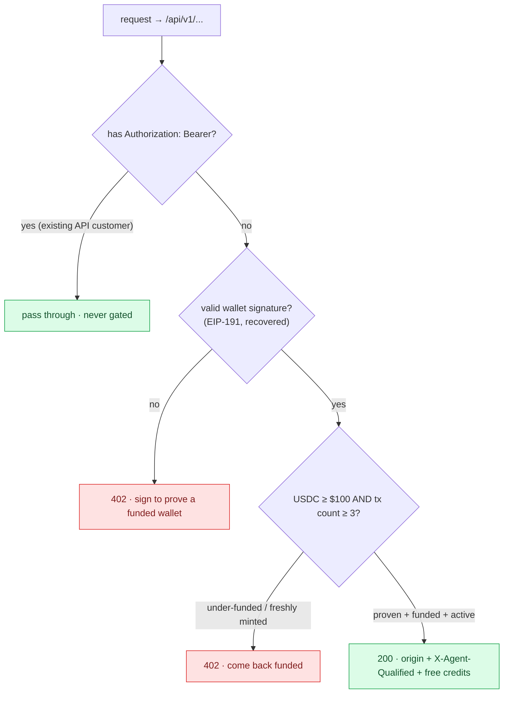
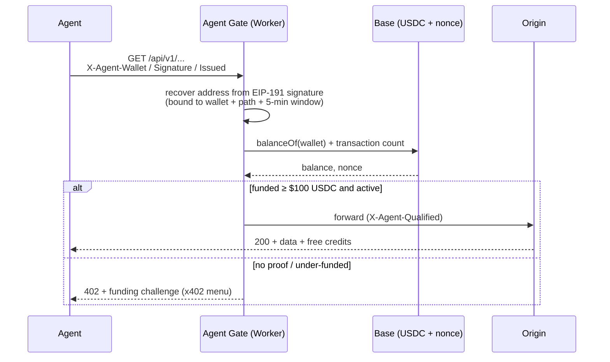
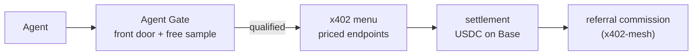

# Agent Gate

A Cloudflare Worker that gates your data/API surface on **economics, not identity**.
Before the origin is touched it proves the caller controls a funded wallet, reads its
on-chain USDC balance + activity on Base, and either welcomes a qualified agent buyer
(serve + free credits, pay-per-call via [x402](https://github.com/StartupHub-AI/x402-mesh))
or returns a `402` funding challenge. Existing API-key customers and public pages pass
straight through, so nothing you already serve breaks.

> **Live demo:** it's running in front of a real API right now. Try it:
> ```bash
> curl https://www.startuphub.ai/api/v1/startups
> ```
> You get the `402` agent challenge. Send a valid `Authorization: Bearer <key>` and you
> pass straight through to normal auth.

## The decision



<details><summary>same logic, in one glance</summary>

```
request to /api/v1/...
   ├─ has Authorization: Bearer (existing API customer) → pass through, never gated
   ├─ no proven wallet ............................... 402  "sign to prove a funded wallet"
   ├─ balance < $100 USDC ............................ 402  "come back funded"
   ├─ tx count < 3 (freshly minted) .................. 402  "no qualifying history"
   └─ proven + funded + active ...................... 200  origin + X-Agent-Qualified, free credits
```
</details>

## How an agent proves its wallet (EIP-191, not a trusted header)

The address is **recovered from a signature**, so it cannot be spoofed. The agent
signs this exact message with its funded wallet and sends three headers:

```
message:  StartupHub Agent Gate
          Wallet: <its address>
          Path: <the request path>
          Issued: <unix seconds>

headers:  X-Agent-Wallet: 0x...
          X-Agent-Signature: 0x...   (65-byte EIP-191 personal_sign)
          X-Agent-Issued: <unix seconds>
```

The proof is bound to the wallet + path + a 5-minute freshness window, so a captured
signature can't be replayed on another path or after it expires.



## Run + test locally

```bash
npm install

# 1. the wallet-proof unit test (valid proof passes; replay + spoof rejected)
npm run test:sign

# 2. dev server
npm run dev   # http://localhost:8787

# 3. read any wallet's verdict (no origin, no signature needed, read-only)
curl "localhost:8787/__agent-gate/check?wallet=0x<any-base-wallet>" | jq

# 4. an unsigned/anonymous request to the gated surface gets the 402 challenge
curl -s localhost:8787/api/v1/startups | jq        # -> prove_wallet instructions
```

`/__agent-gate/check?wallet=0x...` returns the raw verdict (balance, tx_count, funded,
active, qualified, reason) so you can tune `MIN_USDC` / `MIN_NONCE` against real addresses.

## Deploy (your Cloudflare account)

It's deploy-safe: signature-proven wallets + API-key passthrough mean existing paying
customers are never blocked.

```bash
npx wrangler deploy            # ships to <name>.<subdomain>.workers.dev
```

For the intent scan, set a getLogs-capable Base RPC as a secret (the scan uses
`alchemy_getAssetTransfers`):

```bash
echo "https://base-mainnet.g.alchemy.com/v2/<KEY>" | wrangler secret put BASE_RPC_URL
```

Test on the `workers.dev` URL, then go live in front of ONE endpoint by uncommenting the
`[[routes]]` block in `wrangler.toml` and re-deploying. Widen to `/api/v1/*` once you're
happy. Optional: create the KV namespace (`wrangler kv:namespace create AGENT_GATE_KV`) +
uncomment its binding to cache verdicts per wallet.

## What's real vs the next milestones

| Real now | Next milestones |
|---|---|
| EIP-191 wallet-proof (recovered, replay + spoof resistant) | Web Bot Auth (RFC 9421) as an alternative proof |
| On-chain USDC `balanceOf` + activity nonce on Base | Intent score: tx-graph vs `KNOWN_PAYEES` allowlist + AI classifier |
| API-key (Bearer) passthrough, public-page passthrough | — |
| 402 challenge / qualified passthrough + KV verdict cache | Free-credit grant issued + metered via x402 (currently a header stub) |

## How it composes

A qualified agent gets handed the **x402 menu**: priced endpoints return `402` with a
mesh menu, settling in USDC on Base. The gate is the front door + free sample; x402 is the
settlement + referral layer behind it. See
[x402-mesh](https://github.com/StartupHub-AI/x402-mesh).



## License

MIT
